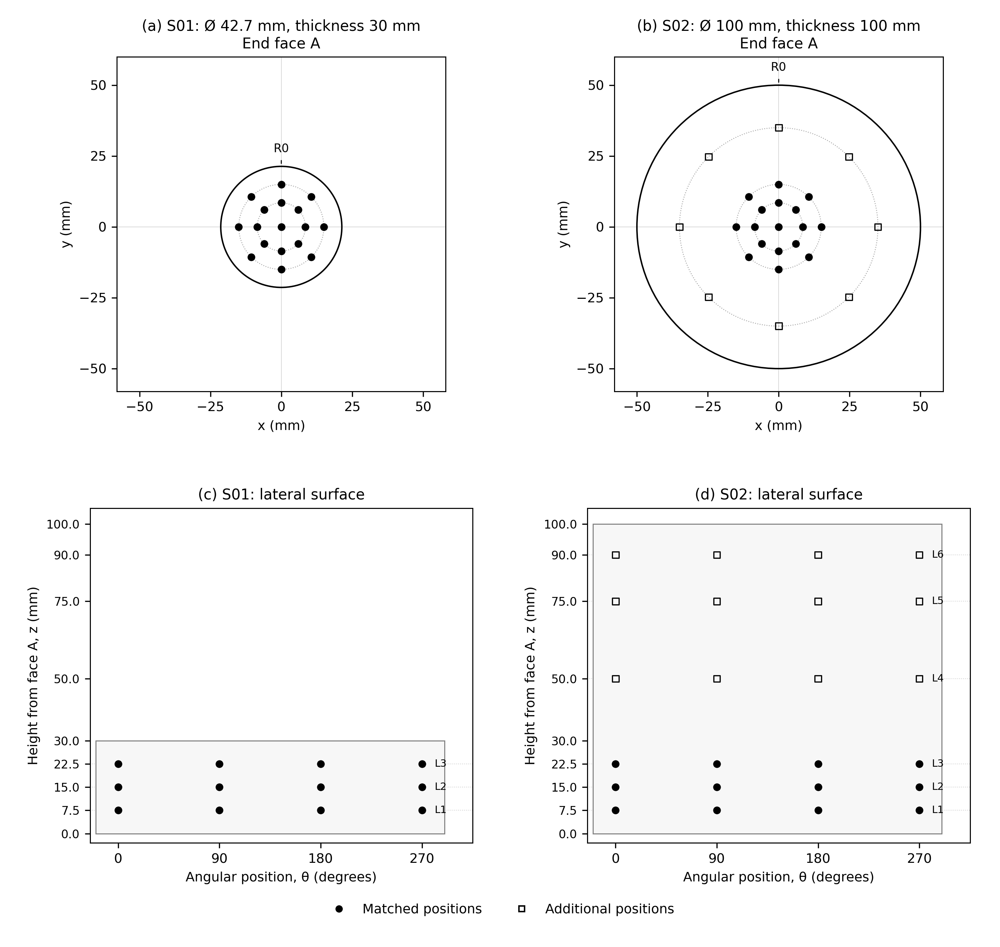

# Silicon resistivity mapping

I put together this script to plan the resistivity measurements on our all silicon samples (two different sizes) for ET-CRISTAL. We want to compare the same radii and angles on the end faces, and the same distances inward from both ends on the lateral surfaces.

These are proposed positions. We still need to agree on the spacing and contact arrangement with Duy and Alejandro.

## Measurement layout



[Download the PDF](outputs/measurement_layout.pdf) · [Download the coordinates](outputs/measurement_coordinates.csv)

## Samples

| Sample | Diameter | Thickness | Both end faces | Lateral surface | Total |
| --- | --- | --- | --- | --- | --- |
| S01 | 42.7 mm | 30 mm | 34 | 12 | 46 |
| S02 | 100 mm | 100 mm | 50 | 24 | 74 |

Totals count unique physical locations and exclude repeat readings or changes in probe orientation.

## Flat end faces

Both samples have a central point and eight points every 45° on rings at 8.5 and 15 mm. S02 has an additional ring at 35 mm. We repeat these positions on both faces.

## Lateral surface: comparison from both ends

The lateral grid uses offsets of 7.5, 15 and 22.5 mm inward from each end, with four angles at each height: 0°, 90°, 180° and 270°.

The coordinate z always starts at face A. The distance from face B is therefore `thickness - z`.

| Sample | Row | z from face A (mm) | Distance from face B (mm) |
| --- | --- | --- | --- |
| S01 | L1 | 7.5 | 22.5 |
| S01 | L2 | 15 | 15 |
| S01 | L3 | 22.5 | 7.5 |
| S02 | L1 | 7.5 | 92.5 |
| S02 | L2 | 15 | 85 |
| S02 | L3 | 22.5 | 77.5 |
| S02 | L4 | 77.5 | 22.5 |
| S02 | L5 | 85 | 15 |
| S02 | L6 | 92.5 | 7.5 |

For S01, the rows selected from the two ends coincide, so each location is measured once. S02 needs three separate rows near each end.

| Reference end | Offset (mm) | S01 row | S02 row |
| --- | --- | --- | --- |
| Face A | 7.5 | L1 | L1 |
| Face A | 15 | L2 | L2 |
| Face A | 22.5 | L3 | L3 |
| Face B | 7.5 | L3 | L6 |
| Face B | 15 | L2 | L5 |
| Face B | 22.5 | L1 | L4 |

The previous S02 rows at 50, 75 and 90 mm have been replaced by 77.5, 85 and 92.5 mm. There is no central sidewall row on S02 in this revised plan. We can add one later if we need to investigate the middle region.

## Running the script

Use Python 3.10 or later. From the project folder:

```bash
python -m pip install -r requirements.txt
python plot_mapping.py --output outputs
```

To use a virtual environment, first run `python -m venv .venv`. Activate it with `.venv\Scripts\Activate.ps1` in Windows PowerShell or `source .venv/bin/activate` on Linux/macOS, then run the commands above.

The outputs are a vector PDF, a 300 dpi PNG and a CSV with all 120 locations, including distances from both faces. Filled circles show positions selected for comparison; open squares show the extra end-face ring on S02. Detailed point identifiers are in the CSV.

## Coordinates and labels

The origin is the centre of face A. Looking towards face A, R0 is +y, +x is right and +z runs into the sample towards face B. Theta increases clockwise from R0:

```text
x = r sin(theta)
y = r cos(theta)
Face A: z = 0
Face B: z = sample thickness
```

The angle is blank for the centre. Face B keeps the same coordinates fixed to the sample. Turning the cylinder over about the y axis mirrors the visible face-B layout left to right. Keep the physical reference using the holder or a photograph, without marking the optical surfaces.

- `C`: centre.
- `I1` to `I8`: 8.5 mm ring.
- `O1` to `O8`: 15 mm ring.
- `E1_1` to `E1_8`: extra 35 mm ring on S02.
- Ring numbers 1 to 8 correspond to 0°, 45°, 90°, 135°, 180°, 225°, 270° and 315°.
- Lateral rows use the table above. Suffixes `a`, `b`, `c`, `d` mean 0°, 90°, 180°, 270°.

A record is identified by sample, surface and point, for example `S01 / A / I3` or `S02 / lateral / L6b`.

The `matched_location` flag identifies planned comparisons. For lateral locations, compare angle and distance from the chosen end using the row-pair table. A single S01 row can contribute to both end-referenced comparisons. The radii, total thicknesses and electrical sampling volumes still differ.

## Before measuring

The plotted positions are probe-array centres. We need to agree on probe spacing and orientation, clearance from edges and bevels, surface preparation and geometry corrections. Lateral measurements depend on reliable contact on curved surfaces. Matching coordinates does not remove geometry effects or establish equivalent original positions in the ingot.

These measurements do not provide a complete map of the interior, We would also need to record temperature, lighting, current, voltage, settling time, contact arrangement, preparation, uncertainty and repeat readings with the results.

Once the ambient temperature procedure is established, we can use it as a baseline for planning cryogenic measurements in our laboratory.

